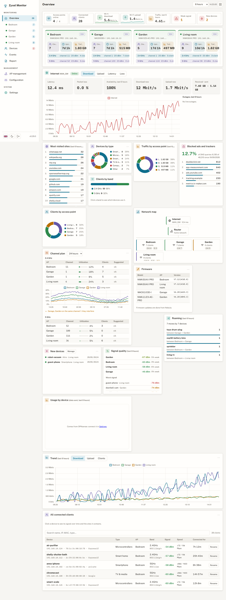
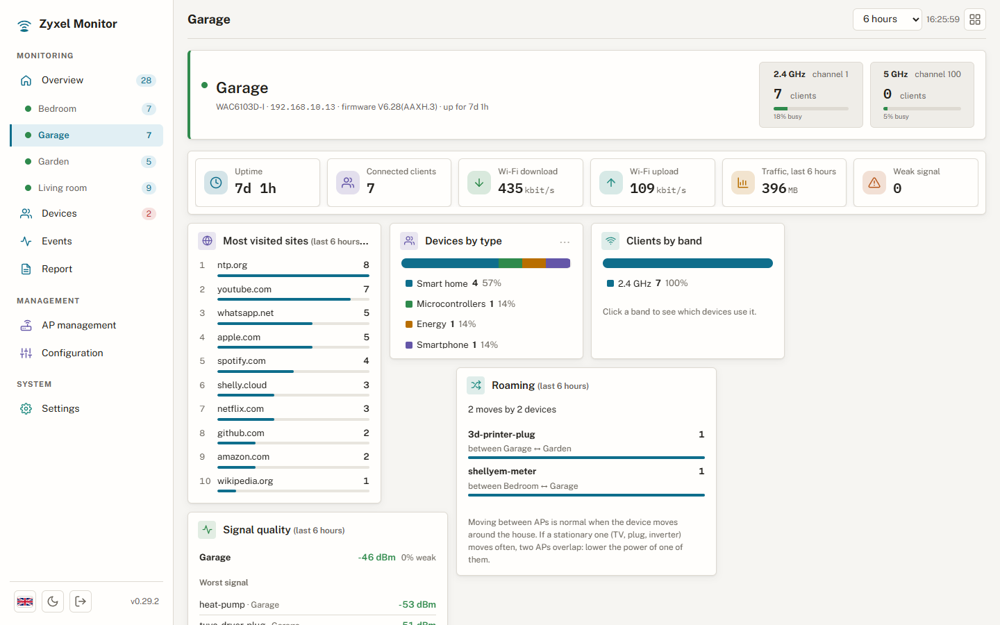
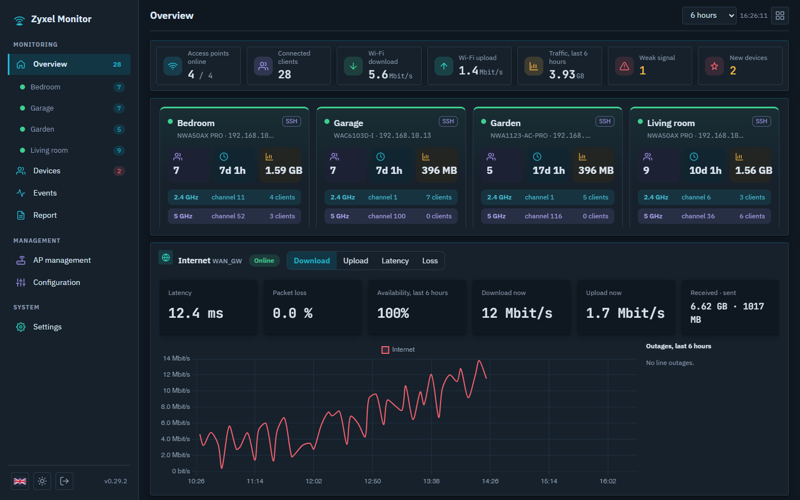
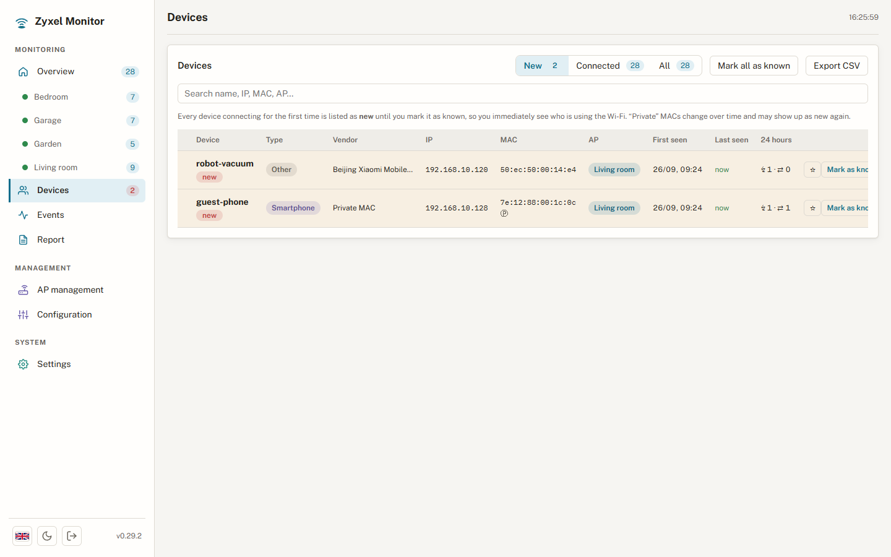
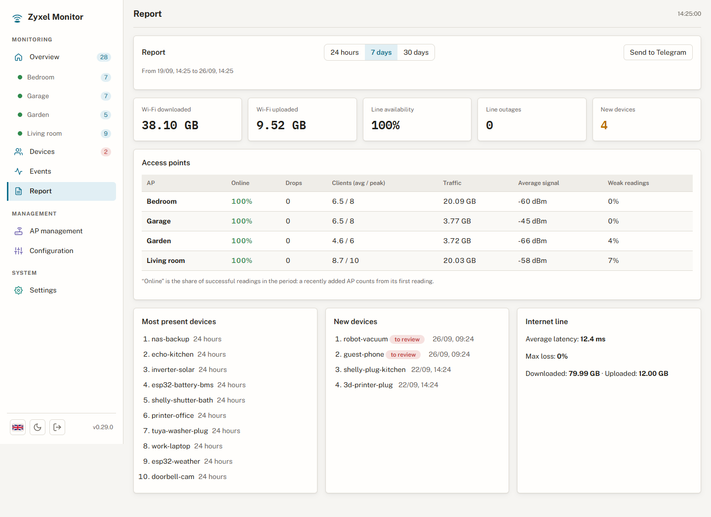
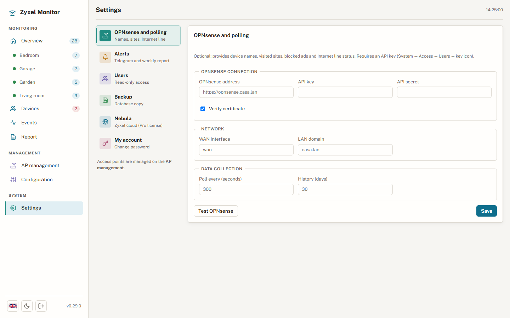
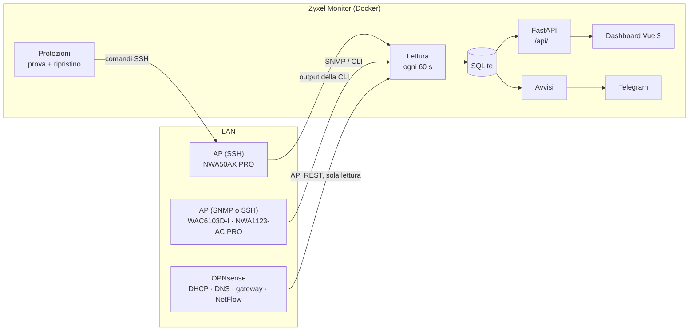

# Zyxel Monitor

[English](README.md) · **Italiano**

[](https://fastapi.tiangolo.com)
[](https://vuejs.org)
[](docker-compose.yml)
[](backend/tests)
[](LICENSE)

Pannello self-hosted di monitoraggio e gestione per gli **access point Zyxel gestiti da Nebula con la licenza
gratuita Base**. Con Base l'OpenAPI di Nebula non espone né client né statistiche: il pannello legge tutto in
locale dagli AP (SNMP e SSH) e, se c'è, da un firewall OPNsense. Chi è collegato e come, quanto traffico,
quali canali sono affollati, quando è caduta la linea Internet.



> Gli screenshot vengono da una casa dimostrativa con dati inventati (`scripts/demo_data.py`), mai da una rete reale.

## Cosa fa

**Monitoraggio**
- **Access point**: online/offline, modello, firmware, uptime, CPU e memoria, canale, potenza e occupazione
  del canale per radio, client per banda.
- **Client**: nome, tipo, produttore (dal MAC, elenco IEEE), banda, segnale, velocità, da quanto è collegato;
  storico del segnale e siti visitati per ogni dispositivo.
- **Traffico**: download, upload e client Wi-Fi nel tempo, per AP e per tutto il sito.
- **Linea Internet** (con OPNsense): stato del gateway, latenza, perdita, disponibilità, disservizi, velocità e
  GB della WAN, quota di richieste DNS bloccate (pubblicità e tracker).
- **Piano dei canali**: occupazione adesso e nel tempo, AP che si sovrappongono, proposta con 1/6/11.
- **Roaming**: quali dispositivi passano da un AP all'altro e quali rimbalzano (segno di celle sovrapposte).
- **Dispositivi**: tutti quelli mai visti; i nuovi restano segnalati finché non li riconosci; quelli
  *importanti* (inverter, cancello, allarme…) mandano un avviso quando si scollegano.
- **Report**: 24 ore, 7 o 30 giorni — disponibilità, cadute, client medi e di picco, traffico, segnale.

**Avvisi** su Telegram: AP offline/online, linea Internet caduta/tornata, dispositivo nuovo, dispositivo
importante scollegato, canale saturo, modifiche alla configurazione, e un report settimanale ogni lunedì.

**Gestione (facoltativa, spenta di default)**: potenza, canale e larghezza per banda, nome e password del
Wi-Fi, rete ospiti, opzioni di roaming, velocità minima, rifiuto dei dispositivi 802.11b, LED, riavvio
programmato… impostati per tutto il sito e personalizzabili per singolo AP, sempre con la **prova controllata**
e il ripristino automatico (vedi sotto).

**Il resto**: tema chiaro e scuro, italiano e inglese, dashboard personalizzabile (widget da spostare e
ridimensionare), utenti in sola lettura, esportazione CSV, backup notturno del database, installabile come
app sul telefono (PWA, in HTTPS).

## Screenshot

| | |
|---|---|
|  **Access point**: intestazione con una tessera per banda (canale, client, occupazione), indicatori con mini-grafico, widget dell'AP. |  **Tema scuro**: la stessa dashboard con la palette "console". |
|  **Dispositivi**: nuovi da riconoscere, produttore, scollegamenti e spostamenti nelle ultime 24 ore, dispositivi importanti (★). |  **Report**: disponibilità e traffico per AP, linea Internet, dispositivi nuovi e più presenti. |
|  **Impostazioni**: una sezione alla volta — OPNsense, avvisi, utenti, backup, Nebula, account. | |

## Come funziona



### Il ciclo di lettura
Ogni `POLL_INTERVAL` secondi (60 di default) il pannello:
1. **legge tutti gli AP in parallelo** — via SNMP sul MIB Zyxel, oppure con una sessione SSH interattiva
   (la CLI Zyxel non accetta comandi passati in riga a `ssh`: il pannello apre una shell e invia
   `show wireless-hal station info`, `show wireless-hal statistic`, `show running-config`…);
2. **dà un nome ai dispositivi**: prima i lease DHCP di Kea da OPNsense, poi il DNS inverso, poi l'IP; i nomi
   che scrivi nel pannello valgono più di tutto;
3. **salva** stato degli AP, client collegati, contatori di traffico, occupazione dei canali e segnale;
4. **ricava gli eventi** confrontando con il giro precedente: collegamento, scollegamento, roaming (stesso MAC,
   AP diverso), AP giù/su, dispositivo nuovo, linea caduta/tornata. Un AP che non risponde tiene i suoi
   client: una lettura fallita non genera scollegamenti finti;
5. **legge OPNsense** (se configurato): le nuove richieste DNS dei client Wi-Fi (ridotte al dominio
   principale, es. `bbc.co.uk`), lo stato dei gateway, i contatori della WAN;
6. esegue **avvisi**, **backup notturno** e, se la gestione è accesa, il **riallineamento** periodico degli AP.

Traffico e velocità si calcolano dalla differenza fra contatori cumulativi; un contatore che torna indietro
(riavvio dell'AP) viene scartato. Lo storico oltre `RETENTION_DAYS` si cancella ogni ora.

### Da dove arrivano i dati

| Fonte | Cosa fornisce | Modelli / note |
|---|---|---|
| **SNMP v2c/v3** (MIB Zyxel `1.3.6.1.4.1.890.1.15.3`) | client (MAC, SSID, RSSI, ora di collegamento), radio, traffico per SSID, uptime | WAC6103D-I, NWA1123-AC PRO |
| **SSH** (CLI) | client con IP, banda, RSSI, velocità, standard Wi-Fi; occupazione e potenza; CPU/memoria; running-config | NWA50AX PRO (con Nebula l'agente SNMP resta `active: no`) e ogni modello con SSH |
| **API OPNsense** (facoltativa, solo GET) | nomi dai lease Kea DHCP, siti visitati e bloccati (Unbound), stato gateway, contatori WAN, byte per indirizzo da NetFlow | |
| DNS inverso / tabella ARP | nomi e IP di riserva | quando OPNsense non c'è |
| Elenco OUI IEEE | produttore di ogni MAC | scaricato nell'immagine Docker durante la build |

### Gestire gli AP senza romperli
Nebula continua a imporre la sua configurazione, quindi **di default il pannello monitora soltanto** e non
scrive mai sugli AP. Quando accendi la gestione (pagina Configurazione):
- **Anteprima** — prima di inviare qualsiasi cosa vedi i comandi esatti per ogni AP (password mascherate).
- **Prova controllata** — la modifica va prima su un AP; dopo 5 minuti il pannello confronta i dispositivi
  collegati a tutto il sito. Solo se non sono calati la estende agli altri AP, e poi ricontrolla.
- **Ripristino automatico** — se i dispositivi collegati calano oltre il 30%, ogni AP toccato torna al backup
  fatto subito prima e va in pausa. I dispositivi che non sono rientrati vengono elencati.
- **Capacità per AP** — larghezze, WPA3 e opzioni si propongono solo dove il modello le supporta; alcune voci
  (es. velocità minima) compaiono solo dopo che l'AP le ha dichiarate in *Esplora comandi*, che chiede aiuto
  alla CLI (`?`) senza cambiare nulla.
- **Riallineamento** — ogni 15 minuti il pannello rilegge gli AP e rimette le impostazioni che un riavvio o
  Nebula hanno riportato indietro. Il pannello non esegue `write`: la configurazione salvata sull'AP resta
  quella di Nebula.

Regola pratica: **un solo capo per la configurazione**. Finché Nebula gestisce gli AP, usa il pannello per
osservare e per provare singole modifiche; i valori definitivi mettili anche in Nebula.

### Avvisi
Gli avvisi partono dagli eventi salvati, letti in ordine: nessuno si perde o arriva due volte, anche dopo un
riavvio. Un AP che sparisce per una sola lettura e torna entro la tolleranza non genera avvisi. I dispositivi
importanti avvisano dopo 5 minuti scollegati e di nuovo quando tornano.

## Access point compatibili

Il pannello parla con le interfacce di gestione degli AP (CLI via SSH e SNMP), che tutti gli AP business Zyxel
delle famiglie **NWA / WAC / WAX / WBE** hanno in comune, sia sotto Nebula sia da soli. La compatibilità dipende
quindi dal formato dell'output della CLI, non dalla licenza Nebula.

**Provati su AP reali**

| Modello | Wi-Fi | Firmware | Lettura |
|---|---|---|---|
| NWA50AX PRO | 6 | V7.12 | SSH |
| WAC6103D-I | 5 | V6.28 | SNMP o SSH |
| NWA1123-AC PRO | 5 | V6.28 | SNMP o SSH |

**Dovrebbero funzionare** — stessa famiglia di CLI e stesse linee di firmware (6.x / 7.x), non ancora provati
con questo pannello:

| Wi-Fi | Modelli |
|---|---|
| 7 | NWA30BE, NWA50BE, NWA50BE PRO, NWA55BE, NWA90BE, NWA90BE PRO, NWA110BE, NWA130BE, NWA210BE, NWA240BE, WBE510D, WBE530, WBE630S, WBE660S |
| 6 / 6E | NWA50AX, NWA55AXE, NWA90AX PRO, NWA110AX, NWA210AX, NWA210AXv2, NWA220AX-6E, WAX300H, WAX510D, WAX610D, WAX620D-6E, WAX630S, WAX640S-6E, WAX650S, WAX655E |
| 5 | NWA1123-ACv3, WAC500, WAC500H, WAC6552D-S, WAC6553D-E |

Come aggiungerne uno: *Gestione AP → Aggiungi → Rileva protocollo* controlla se rispondono SNMP o SSH e propone il metodo.
Se un dato resta vuoto ("n.d."), apri *Gestione AP → Output CLI*, copia il testo e apri una issue: i lettori
sono piccoli e le differenze fra modelli di solito si sistemano con una riga. I modelli Wi-Fi 7 vengono
trattati come Wi-Fi 6 sulle bande 2.4/5 GHz; la banda 6 GHz e i canali da 320 MHz non sono ancora configurabili.

**Non supportati**: i prodotti consumer Zyxel (Multy, Armor, router NBG) e gli AP di altre marche: hanno un
sistema operativo e una CLI diversi.

Fonti: [access point Nebula](https://www.zyxel.com/us/en/products_services/Nebula-Cloud-Networking-Access-Points-Nebula-Cloud-Managed-Access-Points/specification)
e [guida utente serie NWA/WAC/WAX/WBE](https://download.zyxel.com/WAC500/user_guide/WAC500_V6.70_Ed1.pdf) di Zyxel.

## Installazione con Docker

```bash
git clone https://github.com/wifi75/zyxel-monitor.git && cd zyxel-monitor
cp .env.example .env          # almeno APS, SNMP_COMMUNITY, SSH_PASSWORD
docker compose up -d --build
```
Dashboard: `http://<ip-server>:8000` — documentazione API: `/docs`.
Primo accesso: **utente `admin`, password `Admin12345`** — il pannello chiede di cambiarla.

Il container usa `network_mode: host` per raggiungere gli AP e leggere la tabella ARP; i dati stanno nel
volume `/data`. Per Portainer c'è `docker-compose.portainer.yml`, che compila dal repository Git: *Pull and
redeploy* lo aggiorna e le pagine aperte si ricaricano da sole.

### Prerequisiti in Nebula
*Site-wide → Configure → General settings*:
- **SNMP access**: SNMPv2 attivo, con una community a scelta;
- **Administrative Access**: SSH e SNMP spuntati;
- **Permit access… from designated IP addresses**: aggiungere il server di monitoraggio, altrimenti la regola
  predefinita *Deny all* blocca tutto.

### Prerequisiti in OPNsense (facoltativo)
- *Unbound DNS*: statistiche attive;
- una chiave API (*System → Access → Users → icona chiave*); il pannello legge soltanto.

## Configurazione (`.env`)

Dopo il primo avvio AP, credenziali e OPNsense si gestiscono dal pannello (stanno nel database); il `.env`
serve solo a importarli la prima volta.

| Variabile | Default | Descrizione |
|---|---|---|
| `APS` | 4 AP d'esempio | `NOME\|IP\|snmp o ssh`, separati da virgola |
| `SNMP_COMMUNITY` | `public` | community SNMP v2c impostata in Nebula |
| `SSH_USER` / `SSH_PASSWORD` | `admin` / — | *Local credentials* di Nebula |
| `OPNSENSE_URL` | — | es. `https://opnsense.esempio.lan` (col nome host se c'è un reverse proxy) |
| `OPNSENSE_KEY` / `OPNSENSE_SECRET` | — | chiave API di OPNsense |
| `OPNSENSE_VERIFY_TLS` | `true` | `false` solo con certificati autofirmati |
| `OPNSENSE_WAN_IF` | `wan` | interfaccia verso Internet (es. `opt1` per una VLAN del provider) |
| `LOCAL_DOMAIN` | — | dominio della LAN, escluso dai "siti visitati" |
| `POLL_INTERVAL` | `60` | secondi fra una lettura e l'altra |
| `RETENTION_DAYS` | `30` | giorni di storico |
| `SECRET_KEY` | generata | firma delle sessioni; se resta quella d'esempio viene creata in `data/secret.key` |
| `BACKUP_DIR` | `/data/backups` | copie notturne del database (ultime 7); montaci una cartella del NAS |

## Sicurezza
- Login del pannello: dopo 5 password sbagliate l'utente è bloccato per 15 minuti; gli utenti in sola lettura
  sono bloccati dal server, non solo nascosti nell'interfaccia.
- Una password SSH rifiutata non viene ritentata per 10 minuti (gli AP Zyxel bloccano l'IP dopo troppi tentativi).
- Intestazioni di sicurezza su ogni risposta (`nosniff`, niente iframe, niente referrer); HSTS in HTTPS.
- I segreti non escono dal server: l'API dice solo se una password è impostata.
- Il file `.env` è escluso da git.

**HTTPS** — il container parla solo HTTP: davanti serve un reverse proxy con il certificato. Con OPNsense:
`os-acme-client` per il certificato, `os-haproxy` con un servizio pubblico sulla 443 che aggiunge
`X-Forwarded-Proto: https`, e un *host override* in Unbound perché dalla LAN si arrivi al proxy.

**Accesso da fuori casa** — non aprire la porta del pannello sul router: usa WireGuard di OPNsense (un peer
per telefono o PC, DNS verso OPNsense) e apri il pannello col suo nome, come da casa.

## Sviluppo locale

```bash
python3 -m venv .venv && .venv/bin/pip install -r backend/requirements.txt
cd frontend && npm install && npm run build && cd ..
ln -s ../frontend/dist backend/static                 # l'interfaccia compilata servita dal backend
cd backend && ../.venv/bin/uvicorn app.main:app --port 8000
```
Interfaccia con ricarica automatica: `cd frontend && npm run dev` (porta 5173, proxy su `/api`).

**Modalità dimostrativa** — una casa inventata per lavorare sull'interfaccia e fare gli screenshot, senza
toccare nessun AP:
```bash
cd backend
DB_PATH=../demo/monitor.db python ../scripts/demo_data.py
DB_PATH=../demo/monitor.db ZM_DEMO=1 uvicorn app.main:app --port 8010
python ../scripts/screenshots.py http://127.0.0.1:8010    # serve: pip install playwright
```

**Controlli** prima di ogni commit:
```bash
.venv/bin/ruff check backend scripts
(cd backend && ../.venv/bin/python -m pytest -q tests)
(cd frontend && npm run build)                        # comprende il controllo dei tipi (vue-tsc)
```

La struttura del progetto è descritta nel [README in inglese](README.md#project-structure).

## Licenza

[MIT](LICENSE) — ideato e sviluppato da Tiziano Cassone.
