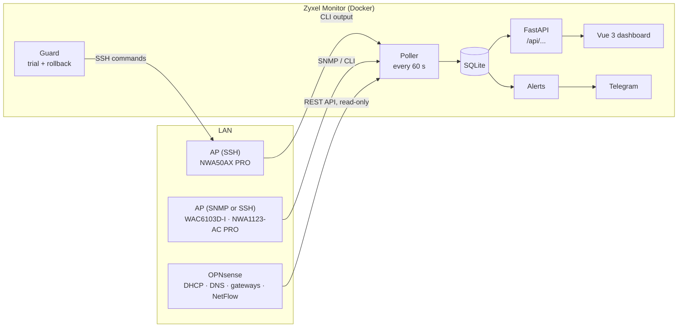

# Zyxel Monitor

**English** · [Italiano](README.it.md)

[](https://fastapi.tiangolo.com)
[](https://www.python.org)
[](https://vuejs.org)
[](https://www.typescriptlang.org)
[](frontend/src/i18n)
[](https://vite.dev)
[](https://www.chartjs.org)
[](https://www.sqlite.org)
[](docker-compose.yml)
[](#where-the-data-comes-from)
[](backend/app/api.py)
[](backend/tests)
[](ruff.toml)
[](https://semver.org)
[](CHANGELOG.md)
[-brightgreen)](https://github.com/wifi75/zyxel-monitor/commits)
[](https://github.com/wifi75/zyxel-monitor/commits)
[](https://github.com/wifi75/zyxel-monitor/stargazers)
[](LICENSE)

Self-hosted monitoring and management panel for **Zyxel access points run by Nebula with the free Base
licence**. On Base, Nebula's OpenAPI exposes neither clients nor statistics, so this panel reads everything
locally from the APs (SNMP and SSH) and, optionally, from an OPNsense firewall: who is connected, how well,
how much traffic, which channels are crowded, when the Internet line dropped.


> Screenshots are taken from a demo house with invented data (`scripts/demo_data.py`), never from a real network.

## Contents
- [What it does](#what-it-does)
- [Screenshots](#screenshots)
- [How it works](#how-it-works)
- [Compatible access points](#compatible-access-points)
- [Installation](#installation-with-docker)
- [Configuration](#configuration-env)
- [Security](#security)
- [Development](#local-development)

## What it does

**Monitoring**
- **Access points**: online/offline, model, firmware, uptime, CPU and memory, channel, power and channel
  utilisation per radio, clients per band.
- **Clients**: name, device type, vendor (from the MAC, IEEE list), band, signal, speed, connection time;
  signal history and visited sites for every device.
- **Traffic**: Wi-Fi download/upload and clients over time, per AP and for the whole site.
- **Internet line** (with OPNsense): gateway status, latency, packet loss, availability, outages, WAN speed and
  GB, share of DNS queries blocked (ads and trackers).
- **Channel plan**: channel utilisation now and over time, overlapping APs, suggested 1/6/11 layout.
- **Roaming**: which devices move between APs and which ones keep bouncing (a sign of overlapping cells).
- **Devices**: every device ever seen; new ones are flagged until you mark them as known; *important* ones
  (inverter, gate, alarm…) trigger an alert when they drop off.
- **Report**: 24 hours, 7 or 30 days — availability, drops, average and peak clients, traffic, signal.

**Alerts** — on Telegram: AP down/up, Internet line down/up, new device, important device disconnected,
saturated channel, configuration changes, plus a weekly report every Monday.

**Management (optional, off by default)** — power, channel and width per band, Wi-Fi name and password, guest
network, roaming options, minimum data rate, 802.11b rejection, LEDs, scheduled reboot… set for the whole site
and overridden per AP, always applied through a **controlled trial** with automatic rollback (see below).

**Everything else** — light and dark theme, Italian and English, customisable dashboard (drag and resize
widgets), read-only users, CSV export, nightly database backup, installable as a phone app (PWA, over HTTPS).

## Screenshots

| | |
|---|---|
|  **Access point**: header with one tile per band (channel, clients, utilisation), indicators with sparklines, per-AP widgets. |  **Dark theme**: the same dashboard in the "console" palette. |
|  **Devices**: new devices to review, vendor, drops and roams in the last 24 hours, important devices (★). |  **Report**: availability and traffic per AP, Internet line, new and most present devices. |
|  **Settings**: one section at a time — OPNsense, alerts, users, backup, Nebula, account. | |

## How it works



### The polling cycle
Every `POLL_INTERVAL` seconds (60 by default) the poller:
1. **reads every AP in parallel** — SNMP walks of the Zyxel MIB, or an interactive SSH session (the Zyxel CLI
   does not accept commands on the `ssh` command line, so the panel opens a shell and sends
   `show wireless-hal station info`, `show wireless-hal statistic`, `show running-config`, …);
2. **resolves names**: Kea DHCP leases from OPNsense first, then reverse DNS, then the IP; aliases you type
   in the panel win over everything;
3. **stores** the AP status, the current clients, traffic counters, channel utilisation and signal samples;
4. **derives events** by comparing with the previous cycle: connect, disconnect, roam (same MAC, different AP),
   AP down/up, new device, Internet line down/up. An unreachable AP keeps its clients, so a failed reading does
   not produce fake disconnections;
5. **reads OPNsense** (if configured): new DNS queries of Wi-Fi clients (reduced to the main domain, e.g.
   `bbc.co.uk`), gateway status, WAN counters;
6. runs **alerts**, the **nightly backup** and, if management is on, the periodic **re-alignment** of the APs.

Traffic and rates are computed from differences between cumulative counters; a counter that goes backwards
(AP reboot) is skipped. History older than `RETENTION_DAYS` is pruned every hour.

### Where the data comes from

| Source | What it provides | Models / notes |
|---|---|---|
| **SNMP v2c/v3** (Zyxel MIB `1.3.6.1.4.1.890.1.15.3`) | clients (MAC, SSID, RSSI, connection time), radios, traffic per SSID, uptime | WAC6103D-I, NWA1123-AC PRO |
| **SSH** (CLI) | clients with IP, band, RSSI, rates, Wi-Fi standard; channel utilisation and power; CPU/memory; running-config | NWA50AX PRO (its SNMP agent stays `active: no` under Nebula), and any model with SSH |
| **OPNsense API** (optional, GET only) | names from Kea DHCP leases, visited and blocked sites (Unbound), gateway status, WAN counters, NetFlow bytes per address | |
| Reverse DNS / ARP table | fallback names and IPs | when OPNsense is not configured |
| IEEE OUI list | vendor of each MAC | downloaded into the Docker image at build time |

### Managing the APs without breaking them
Nebula keeps pushing its own configuration, so **by default the panel only monitors** and never writes to the
APs. When you switch management on (Configuration page):
- **Preview** — the exact CLI commands for every AP are shown before anything is sent (passwords masked).
- **Controlled trial** — the change goes to one AP first; after 5 minutes the panel compares the devices
  connected to the whole site. Only if they did not drop does it extend the change to the other APs, and
  then checks again.
- **Automatic rollback** — if connected devices drop by more than 30 %, every AP that was touched goes back
  to the backup taken right before, and is paused. Devices that did not come back are listed.
- **Capabilities per AP** — widths, WPA3 and options are offered only where the model supports them; some
  options (e.g. minimum data rate) appear only after the AP declared them in *Explore commands*, which asks
  the CLI for help (`?`) without changing anything.
- **Re-alignment** — every 15 minutes the panel re-reads the APs and re-applies settings that a reboot or
  Nebula reverted. The panel does not run `write`: configuration saved on the AP stays Nebula's.

Rule of thumb: **one master for the configuration**. While Nebula manages the APs, use the panel to observe and
to test single changes; set the final values in Nebula too.

### Alerts
Alerts are built from the stored events, read in order of id, so nothing is lost or sent twice across
restarts. An AP that disappears for a single reading and comes back within the tolerance does not alert.
Important devices alert after 5 minutes offline and again when they come back.

## Compatible access points

The panel talks to the APs' own management interfaces (SSH CLI and SNMP), which all Zyxel business APs of
the **NWA / WAC / WAX / WBE** families share, whether they are run by Nebula or stand-alone. Compatibility
therefore depends on the CLI output format, not on the Nebula licence.

**Tested on real hardware**

| Model | Wi-Fi | Firmware | Read via |
|---|---|---|---|
| NWA50AX PRO | 6 | V7.12 | SSH |
| WAC6103D-I | 5 | V6.28 | SNMP or SSH |
| NWA1123-AC PRO | 5 | V6.28 | SNMP or SSH |

**Expected to work** — same CLI family and firmware lines (6.x / 7.x), not yet tested with this panel:

| Wi-Fi | Models |
|---|---|
| 7 | NWA30BE, NWA50BE, NWA50BE PRO, NWA55BE, NWA90BE, NWA90BE PRO, NWA110BE, NWA130BE, NWA210BE, NWA240BE, WBE510D, WBE530, WBE630S, WBE660S |
| 6 / 6E | NWA50AX, NWA55AXE, NWA90AX PRO, NWA110AX, NWA210AX, NWA210AXv2, NWA220AX-6E, WAX300H, WAX510D, WAX610D, WAX620D-6E, WAX630S, WAX640S-6E, WAX650S, WAX655E |
| 5 | NWA1123-ACv3, WAC500, WAC500H, WAC6552D-S, WAC6553D-E |

How to add one: *AP management → Add → Detect protocol* checks whether SNMP or SSH answers and proposes the method.
If a value stays empty ("n/a"), open *AP management → CLI output*, copy the text and open an issue: the
parsers are small and model-specific differences are usually a one-line fix. Wi-Fi 7 models are handled like
Wi-Fi 6 on the 2.4/5 GHz bands; the 6 GHz band and 320 MHz channels are not configurable yet.

**Not supported**: Zyxel consumer products (Multy, Armor, NBG routers) and non-Zyxel APs — they run a
different operating system and CLI.

Sources: Zyxel's [Nebula access points](https://www.zyxel.com/us/en/products_services/Nebula-Cloud-Networking-Access-Points-Nebula-Cloud-Managed-Access-Points/specification)
and the [NWA/WAC/WAX/WBE series user's guide](https://download.zyxel.com/WAC500/user_guide/WAC500_V6.70_Ed1.pdf).

## Installation with Docker

```bash
git clone https://github.com/wifi75/zyxel-monitor.git && cd zyxel-monitor
cp .env.example .env          # at least APS, SNMP_COMMUNITY, SSH_PASSWORD
docker compose up -d --build
```
Dashboard: `http://<server-ip>:8000` — API docs: `/docs`.
First login: **user `admin`, password `Admin12345`** — the panel asks you to change it.

The container uses `network_mode: host` to reach the APs and read the ARP table; data lives in the `/data`
volume. For Portainer, `docker-compose.portainer.yml` builds from the Git repository ("Pull and redeploy"
updates it, and open pages reload by themselves).

### Nebula prerequisites
*Site-wide → Configure → General settings*:
- **SNMP access**: SNMPv2 on, with a community of your choice;
- **Administrative Access**: SSH and SNMP ticked;
- **Permit access… from designated IP addresses**: add the monitoring server, otherwise the default *Deny all*
  blocks everything.

### OPNsense prerequisites (optional)
- *Unbound DNS*: statistics enabled;
- an API key (*System → Access → Users → key icon*); the panel only reads.

## Configuration (`.env`)

After the first start, APs, credentials and OPNsense are managed from the panel (stored in the database); the
`.env` only seeds them.

| Variable | Default | Description |
|---|---|---|
| `APS` | 4 example APs | `NAME\|IP\|snmp or ssh`, comma separated |
| `SNMP_COMMUNITY` | `public` | SNMP v2c community set in Nebula |
| `SSH_USER` / `SSH_PASSWORD` | `admin` / — | Nebula *Local credentials* |
| `OPNSENSE_URL` | — | e.g. `https://opnsense.example.lan` (use the host name behind a reverse proxy) |
| `OPNSENSE_KEY` / `OPNSENSE_SECRET` | — | OPNsense API key |
| `OPNSENSE_VERIFY_TLS` | `true` | `false` only for self-signed certificates |
| `OPNSENSE_WAN_IF` | `wan` | Internet interface (e.g. `opt1` for a provider VLAN) |
| `LOCAL_DOMAIN` | — | LAN domain, excluded from "visited sites" |
| `POLL_INTERVAL` | `60` | seconds between readings |
| `RETENTION_DAYS` | `30` | days of history |
| `SECRET_KEY` | generated | session signing key; if left as the example, one is created in `data/secret.key` |
| `BACKUP_DIR` | `/data/backups` | nightly database copies (last 7); mount a NAS folder here |

## Security
- Panel login: after 5 wrong passwords the user is locked for 15 minutes; read-only users are enforced by
  the server, not just hidden in the UI.
- A rejected SSH password is not retried for 10 minutes (Zyxel APs block the IP after too many attempts).
- Security headers on every response (`nosniff`, no iframes, no referrer); HSTS when reached over HTTPS.
- Secrets never leave the server: the API only says whether a password is set.
- `.env` is excluded from git.

**HTTPS** — the container speaks plain HTTP; put a reverse proxy with a certificate in front. With OPNsense:
`os-acme-client` for the certificate, `os-haproxy` with a public service on 443 that adds
`X-Forwarded-Proto: https`, and an Unbound host override so the LAN reaches the proxy.

**Remote access** — do not forward the panel's port: use OPNsense's WireGuard (one peer per phone/PC, DNS
pointing to OPNsense) and open the panel by name as if you were home.

## Local development

```bash
python3 -m venv .venv && .venv/bin/pip install -r backend/requirements.txt
cd frontend && npm install && npm run build && cd ..
ln -s ../frontend/dist backend/static                 # compiled UI served by the backend
cd backend && ../.venv/bin/uvicorn app.main:app --port 8000
```
UI with hot reload: `cd frontend && npm run dev` (port 5173, `/api` proxied).

**Demo mode** — a fake house for UI work and screenshots, without touching any AP:
```bash
cd backend
DB_PATH=../demo/monitor.db python ../scripts/demo_data.py
DB_PATH=../demo/monitor.db ZM_DEMO=1 uvicorn app.main:app --port 8010
python ../scripts/screenshots.py http://127.0.0.1:8010    # needs: pip install playwright
```

**Quality checks** before every commit:
```bash
.venv/bin/ruff check backend scripts
(cd backend && ../.venv/bin/python -m pytest -q tests)
(cd frontend && npm run build)                        # includes vue-tsc type checking
```

### Project structure
```
backend/app/
  main.py            FastAPI start-up, background poller, security headers, static UI
  poller.py          polling cycle: AP status, clients, events, samples, DNS, Internet line
  collectors/        snmp.py · ssh.py (CLI parsers) · opnsense.py · names.py (ARP/DNS)
  api.py · insights_api.py · report.py · channels.py · export_api.py      read endpoints
  settings_api.py · policy_api.py · users_api.py · backup.py              management endpoints
  config_items.py    every configurable setting: how to read it from the running-config and the CLI commands
  policy.py · site_config.py · guard.py · restore.py · capabilities.py    configuration, trial, rollback
  alerts.py          Telegram alerts and weekly report
  oui.py · devices.py                vendor from MAC, device type
backend/tests/       pytest: parsers, channel plan, alerts, capabilities, overrides
frontend/src/        Vue 3 + TypeScript: App.vue, components/, i18n/ (it/en), tokens.css (themes)
scripts/             demo_data.py (fake house) · screenshots.py (README images)
```

## Licence

[MIT](LICENSE) — designed and developed by Tiziano Cassone.
